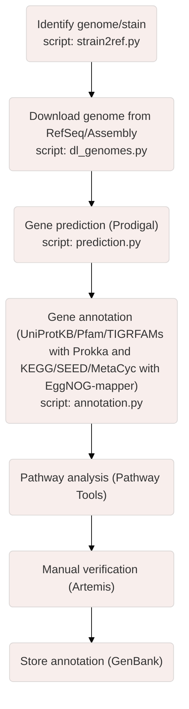

# GenoTools

#### This repository contains various tools, developed by Maxime Naour (UMR 1280 PhAN), to download, analyse and integrate genomic data of prokaryotic organisms at taxonomic and functional scales. 

### Scripts' description

##### To install Edirect (NCBI) to interact with the NCBI database, using command lines, please refer to the markdown file "install_edirect.md".

- "unique_seq.py" script allows comparing two or more genomes to identify unique portions in the genome of the organism of interest in comparison to the genomes of other organisms.
___

These steps describe a general process for annotating and analysing genomes, which is useful for understanding the biological functions and characteristics of a specific organism.

1) Identify genome/strain : This step involves identifying the genome for a specific strain. The "strain2ref.py" script uses NCBI's EDirect tool to retrieve the corresponding NCBI taxonomy ID, the latest GenBank and RefSeq assembly accession numbers, and the URL for a given organism and strain name and writes them to a file.

2) Download the genome from RefSeq/Assembly : RefSeq and Assembly are databases containing genomic sequences. This step downloads the complete genome of an organism, preferably the RefSeq genome, for analysis. The "dl_genomes.py" script allows downloading and creating directories for each taxon from "strain2ref.py" output file.

3) Gene Prediction: In this phase, the genes and coding sequences (CDS) within the genome are identified. Software such as Prodigal are utilized to predict the presence of genes in the genomic sequences. These tools analyze the genomic sequence and recognize the regions that potentially code for proteins, taking into account features such as open reading frames (ORFs) and promoter sequences.

4) Gene Annotation: This step involves assigning biological functions to the predicted genes. Databases such as UniProtKB, Pfam, TIGRFAMs, then KEGG, SEED, and MetaCyc, as well as tools like Prokka and EggNOG-mapper respectively, are used to associate the predicted genes with known functional information. 

5) Metabolic Pathway Analysis: This step involves examining the metabolic pathways present in the organism being studied. Metabolic pathways are sets of interconnected biochemical reactions that involve specific molecules. Analysis of these pathways provides a better understanding of how genes and their products (e.g. enzymes and proteins) work together. Tools like KEGG Mapper, MetaCyc or Pathway Tools can be used to identify and visualize the metabolic pathways.

6) Manual verification: This step involves using software such as Artemis to manually check and correct any errors in the genetic annotations. Although automated tools are very powerful, manual verification is essential to ensure the accuracy and quality of annotations.

7) Storage of annotation: In this final step, the annotated genetic information is stored in a database such as GenBank. This makes the information easily accessible and can be used by others in the scientific community. 

These steps, taken together, allow us to move from raw genomic sequences to a functional understanding of the genes and metabolic pathways within the organism being studied.
___

### References

1) Hyatt, D., Chen, G. L., LoCascio, P. F., Land, M. L., Larimer, F. W., & Hauser, L. J. (2010). Prodigal: prokaryotic gene recognition and translation initiation site identification. BMC Bioinformatics, 11, 119. https://doi.org/10.1186/1471-2105-11-119

2) Seemann, T. (2014). Prokka: rapid prokaryotic genome annotation. Bioinformatics, 30(14), 2068-2069. https://doi.org/10.1093/bioinformatics/btu153

3) Huerta-Cepas, J., Forslund, K., Coelho, L. P., Szklarczyk, D., Jensen, L. J., von Mering, C., & Bork, P. (2017). Fast genome-wide functional annotation through orthology assignment by eggNOG-Mapper. Molecular Biology and Evolution, 34(8), 2115-2122. https://doi.org/10.1093/molbev/msx148

4) Kanehisa, M., & Goto, S. (2000). KEGG: Kyoto Encyclopedia of Genes and Genomes. Nucleic Acids Research, 28(1), 27-30. https://doi.org/10.1093/nar/28.1.27

5) Caspi, R., Billington, R., Ferrer, L., Foerster, H., Fulcher, C. A., Keseler, I. M., ... & Kothari, A. (2016). The MetaCyc database of metabolic pathways and enzymes and the BioCyc collection of pathway/genome databases. Nucleic Acids Research, 44(D1), D471-D480. https://doi.org/10.1093/nar/gkv1164

6) Rutherford, K., Parkhill, J., Crook, J., Horsnell, T., Rice, P., Rajandream, M. A., & Barrell, B. (2000). Artemis: sequence visualization and annotation. Bioinformatics, 16(10), 944-945. https://doi.org/10.1093/bioinformatics/16.10.944

7) Benson, D. A., Cavanaugh, M., Clark, K., Karsch-Mizrachi, I., Lipman, D. J., Ostell, J., & Sayers, E. W. (2017). GenBank. Nucleic Acids Research, 45(D1), D37-D42. https://doi.org/10.1093/nar/gkw1070
