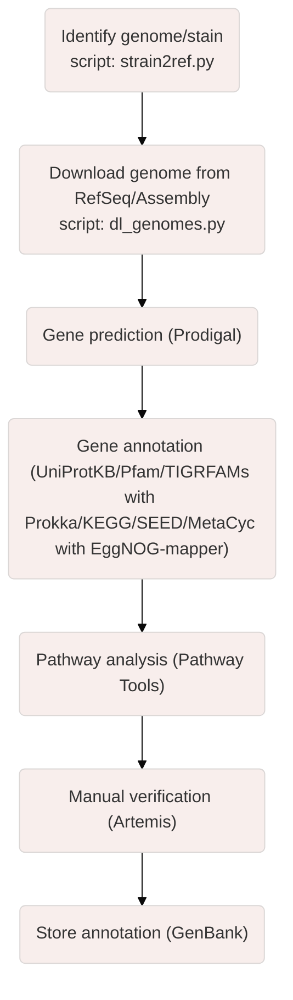

# GenoTools

These steps describe a general process for annotating and analysing genomes, which is useful for understanding the biological functions and characteristics of a specific organism.
1) Identify genome/strain : This step involves identifying the genome for a specific strain. The "strain2ref.py" script uses NCBI's EDirect tool to retrieve the corresponding NCBI taxonomy ID, the latest GenBank and RefSeq assembly accession numbers, and the URL for a given organism and strain name and writes them to a file.

2) Download the genome from RefSeq/Assembly : RefSeq and Assembly are databases containing genomic sequences. This step downloads the complete genome of an organism, preferably the RefSeq genome, for analysis. The "dl_genomes.py" script allows downloading and creating directories for each taxon from "strain2ref.py" output file.

3) Gene prediction : This step identifies the genes and coding sequences (CDS) in the genome. Prodigal and Prokka are software used to predict genes in genomic sequences.

4) Gene annotation : This step assigns biological functions to predicted genes. Several databases (UniProtKB, Pfam, TIGRFAMs and KEGG, SEED, MetaCyc) and tools (respectively : Prokka and EggNOG-mapper) are used to annotate the genes.

5) Metabolic pathway analysis : This step examines the metabolic pathways present in the organism under study. Metabolic pathways are sets of biochemical reactions involving specific molecules and provide an understanding of how genes and their products work together in the organism.

6) Manual verification : Manual verification with software such as Artemis is important to correct any errors and confirm the accuracy of the genetic annotations.

7) Storage of the annotation : Finally, the annotated genetic information is stored in a database such as GenBank for easy access and use by other researchers.

In sum, these steps allow us to move from a raw genomic sequence to a functional understanding of the genes and metabolic pathways of the organism under study.

The "unique_seq.py" script allows comparing two or more genomes to identify unique portions in the genome of the organism of interest in comparison to the genomes of other organisms.
