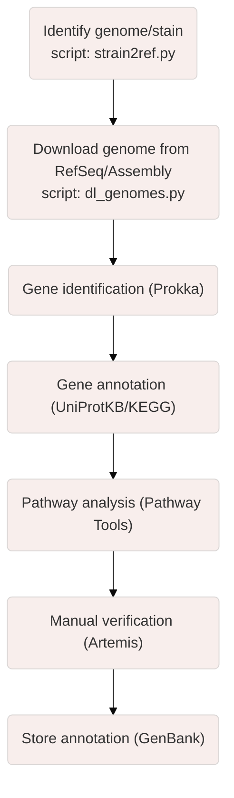

# GenoCompare

The "unique_seq.py" script allows comparing two or more genomes to identify unique portions in the genome of the organism of interest in comparison to the genomes of other organisms.

The "strain2ref.py" script uses NCBI's EDirect tool to retrieve the corresponding NCBI taxonomy ID, the latest GenBank and RefSeq assembly accession numbers, and the URL for a given organism and strain name and writes them to a file.

The "dl_genomes.py" script allows downloading and creating directories for each taxon from "strain2ref.py" output file.
